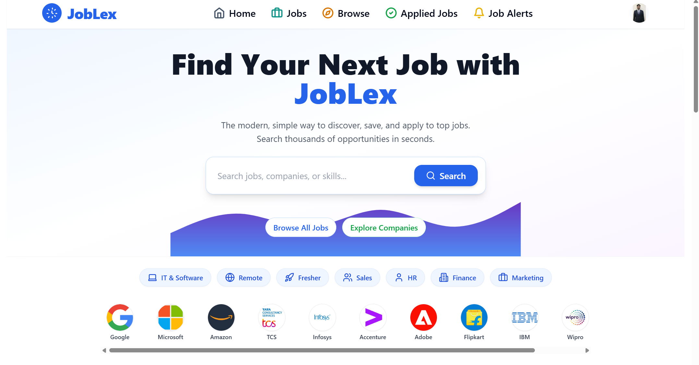

JobLex is a modern, mobile-first campus recruitment platform connecting students, recruiters, and institutions for seamless early-career hiring.

[](https://joblex-vo9q.onrender.com/)

**Live Demo:** [https://joblex-vo9q.onrender.com/](https://joblex-vo9q.onrender.com/)


*JobLex homepage: modern, mobile-friendly, and ready for real users.*

## The Future of Campus Recruitment & Early Careers

**JobLex is not just another job portal.** It’s a purpose-built, full-stack recruitment platform engineered to transform how students and recruiters connect, apply, and hire. Designed for scale, security, and seamless user experience, JobLex is ready to power the next generation of talent acquisition.

---

## 🚀 The Problem
Campus recruitment and early-career hiring are broken:
- **Students** are lost in generic job boards, unable to track applications or find relevant roles.
- **Recruiters** are overwhelmed by unqualified applications and lack tools to manage the hiring funnel efficiently.
- **Institutions** have no visibility into placement analytics or student engagement.

---

## 💡 Our Solution
**JobLex delivers a modern, data-driven, and mobile-first platform that solves these pain points for all stakeholders:**
- **Role-Based Experiences:** Tailored dashboards, workflows, and permissions for students and recruiters.
- **Keyword Tracking & Alerts:** Students can track keywords and receive notifications when relevant jobs are posted.
- **End-to-End Application Tracking:** Every application step is visible, from profile completion to offer.
- **Recruiter Dashboards:** Manage companies, post jobs, and review applicants in real time.
- **Mobile-First Design:** Every feature is optimized for mobile and touch, ensuring accessibility for all users.
- **Cloud Storage:** Secure upload and management of resumes and profile images via Cloudinary.
- **Robust Error Handling:** Consistent, actionable error messages across backend and frontend.
- **Secure, Scalable Infrastructure:** JWT authentication, httpOnly cookies, CORS, and environment-based configuration.

---

## 🌟 Key Features (Live Today)
### For Students
- **Smart Job Search:** Search and filter jobs by category, location, or keyword.
- **Profile & Resume Management:** Upload resumes (PDF/image), set skills, and complete your profile for better visibility.
- **Keyword Alerts:** Track keywords and get notified when matching jobs are posted.
- **Save & Track Jobs:** Bookmark jobs for later and track your application status in one place.

### For Recruiters
- **Multi-Company Management:** Manage multiple companies and their job postings from a single dashboard.
- **Job Posting & Editing:** Post, edit, and delete jobs with ease.
- **Applicant Management:** View, filter, and manage applicants for each job in real time.

### For Institutions (Basic)
- **Company & Job Oversight:** Recruiters can manage company profiles and job listings, laying the foundation for future analytics and reporting.

### Platform-Wide
- **Mobile-First, Accessible UI:** Every component is responsive, touch-friendly, and accessible.
- **Cloud Storage:** All user files are stored securely on Cloudinary.
- **Consistent Error Handling:** Backend and frontend provide clear, actionable feedback for all errors.

---

## Micro Features & Product Details
- **Auto Job Expiry:** Jobs automatically expire after their set date, ensuring only active and relevant listings are visible to users. This keeps the job board fresh and trustworthy for applicants.
- **Profile Completion System:** Users are guided to complete their profiles with a visual progress bar and checklist. This not only improves their chances of being noticed by recruiters but also unlocks the ability to apply for jobs.
- **Job Sharing:** Every job posting can be easily shared with friends or on social media, helping users spread opportunities and recruiters reach more candidates.
- **Keyword Alerts:** Students can set up keyword tracking to receive instant alerts when jobs matching their interests are posted.
- **Resume File Type Support:** The platform supports both PDF and image formats for resume uploads, making it accessible for all users.
- **Mobile Touch Optimizations:** All interactive elements are designed with mobile users in mind, ensuring large touch targets and smooth navigation on any device.
- **Internal & External Jobs:** JobLex supports both internal jobs (apply directly on the platform) and external jobs (redirect to company site, with application tracking). This solves the problem of fragmented application experiences and ensures students can track all their applications in one place, while recruiters can manage both types of postings seamlessly.

---

## **How to Use JobLex**

### **For Students**
1. **Register** as a student on the platform.
2. **Complete your profile** and upload your resume.
3. **Browse and search** for jobs by category, location, or keyword.
4. **Track keywords** to get notified about relevant jobs.
5. **Apply** to jobs directly or mark as applied for external applications.
6. **Save jobs** for later and monitor your application status.

### **For Recruiters**
1. **Register** as a recruiter and set up your company profile(s).
2. **Post new job openings** and manage existing ones.
3. **View, filter, and manage applicants** for each job.
4. **Communicate** with candidates and track hiring progress.

### **For Campus/Institutions**
1. **Onboard** your placement/recruitment team as recruiters.
2. **Oversee company and job listings** posted for your students.
3. *(Coming soon)* Access analytics and placement reports.

---

## 🛣️ Coming Soon / Roadmap
- **Personalized job recommendations**
- **Real-time chat** between candidates and recruiters
- **AI-powered resume screening**
- **Deep analytics** for placement cells and institutions
- **API integrations** with HRMS and ATS platforms
- **Custom branding and white-label solutions** for institutions

---

## 🛠️ Technologies Used

### **Frontend**
- React (with Vite)
- Redux Toolkit
- Redux Persist
- React Router DOM
- Tailwind CSS
- Radix UI
- Lucide React
- Axios
- Framer Motion
- Embla Carousel
- Sonner (toast notifications)
- Class-variance-authority, clsx, tailwind-merge
- ESLint
- PostCSS, Autoprefixer

### **Backend**
- Node.js
- Express
- MongoDB (with Mongoose)
- JWT (jsonwebtoken)
- Multer
- Cloudinary
- Cookie-Parser
- CORS
- Dotenv
- BcryptJS
- Nodemailer
- DataURI

### **Dev & Tooling**
- Nodemon
- Environment-based config (.env files)

---

## 📈 Vision
JobLex is on a mission to become the go-to platform for early-career hiring in India and beyond. We’re building the infrastructure for a transparent, efficient, and delightful hiring experience—one that empowers students, recruiters, and institutions alike.

---

## 👤 About the Founder
Hi, I’m Karan Sundariya.
I built JobLex to address the real challenges I faced as a student and heard from recruiters. My goal is to create a product that not only works, but delights its users and scales with their ambitions. I’m passionate about building robust, user-centric software that solves real problems.

---

## 🛠️ Setup & Deployment
1. **Clone the repository:**
   ```powershell
   git clone https://github.com/karansundariya/JobLex.git
   cd JobLex/JobLex
   ```
2. **Install dependencies:**
   ```powershell
   cd backend
   npm install
   cd ../frontend
   npm install
   ```
3. **Configure environment variables:**
   - Create `.env` files in both `backend/` and `frontend/` (see `.env.example` if available)
   - Set up MongoDB, Cloudinary, and email credentials
4. **Start the servers (in two terminals):**
   ```powershell
   # Terminal 1
   cd backend
   npm run dev
   # Terminal 2
   cd frontend
   npm run dev
   ```
   > If you see PowerShell errors with `&&`, run each command separately.

---

## 🗂️ Folder Structure
```
JobLex/
  JobLex/
    backend/    # Express API, models, controllers, routes
    frontend/   # React app, components, hooks, redux
  README.md
```

---

## 🤝 Get Involved
**We invite you to register on JobLex, try out the platform, and share your feedback!** Your insights help us improve and shape the future of campus recruitment.

- **For Colleges:** Want to pilot JobLex for your campus? [Contact me](mailto:karansundariya@gmail.com)
- **For Startups:** Looking to hire top talent? Let’s talk!
- **For Developers:** Contributions and feedback are welcome.

---

## 📬 Contact
- Email: karansundariya@gmail.com
- LinkedIn: https://www.linkedin.com/in/karansundariya/
- GitHub: https://github.com/karansundariya/JobLex

---

**JobLex: Shaping the future of campus recruitment, one hire at a time.**

Made with ❤️  | Proudly Indian 🇮🇳  
